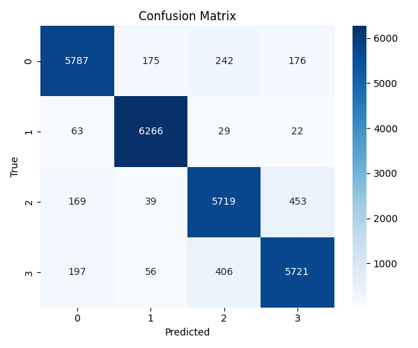

# News-Headline-Classification-using-Comprehensive-Pattern-Learning
This project is a **machine learning system** that classifies news headlines into four categories:
- **World (0)**
- **Sports (1)**
- **Business (2)**
- **Sci/Tech (3)**

It uses **NLP preprocessing, TF-IDF feature extraction, and a Support Vector Machine (SVM)** to achieve state-of-the-art accuracy on the AG News dataset.
> “From noise to knowledge—this repo turns raw headlines into signal.”

---
## ⚙️ How It Works

1. **Data Preparation**  
   - Headlines + descriptions combined into a single text field  
   - Tokenization and stopword removal using NLTK  
   - Cleaned dataset saved to `data/ag_news.csv`

2. **Feature Engineering**  
   - Text transformed with **TF-IDF vectorizer**  
   - Produces a sparse, high-dimensional feature matrix

3. **Model Training**  
   - **SVM classifier** trained on 120k samples  
   - Stored as a scikit-learn pipeline (`tfidf + clf`)  

4. **Evaluation**  
   - Confusion matrix, classification report, accuracy, precision, recall, F1  
   - Results saved in `metrics.json`  

5. **Calibration (Optional)**  
   - `CalibratedClassifierCV` applied to SVM  
   - Enables probability outputs (`predict_proba`)  

---

## 📊 Results

### Metrics (Test Set - 25,520 samples)
- **Accuracy**: 92.05%  
- **Weighted Precision**: 92.04%  
- **Weighted Recall**: 92.05%  
- **Weighted F1**: 92.04%  

### Classification Report
| Class      | Precision | Recall | F1-score | Support |
|------------|-----------|--------|----------|---------|
| World (0)  | 0.93      | 0.91   | 0.92     | 6380    |
| Sports (1) | 0.96      | 0.98   | 0.97     | 6380    |
| Business(2)| 0.89      | 0.90   | 0.90     | 6380    |
| Sci/Tech(3)| 0.90      | 0.90   | 0.90     | 6380    |

### Confusion Matrix (Test Set)


### Full Dataset Predictions


## Predicted Distribution 


----

## 🚀 Project Overview

The goal of this project is to build a **robust, reproducible, and explainable text classification pipeline**.  
Given a news headline , the system predicts the most likely category, along with the model’s **confidence score**.

This work can be applied to:
- News aggregation platforms  
- Personalized feeds / recommendation systems  
- Business intelligence dashboards  
- Social media monitoring  

---

## 🧰 Tech Stack & Tools

- **Python 3.9+**
- **Pandas / NumPy** → data handling
- **NLTK** → tokenization, stopword removal
- **scikit-learn** → TF-IDF vectorization, SVM classifier, calibration
- **Joblib** → model persistence
- **Matplotlib / Seaborn** → metrics visualization
- **HuggingFace Datasets** → AG News dataset
- **Virtual Environment** (`venv`) → reproducible environment

---

## 📌 Key Features

- End-to-end text classification pipeline

- Works with raw text input (headline + description)

- Saves artifacts (models, predictions, metrics) for reproducibility

- Produces visualizations (confusion matrices, heatmaps)

- Supports probability predictions with calibration

- Modular design → easy to extend with deep learning models (e.g., BERT)

---

## 📂 Project Structure
News-Headline-Classification-using-Comprehensive-Pattern-Learning/

- src/
- preprocess.py # Text cleaning & preprocessing
- train.py # Train model pipeline (TF-IDF + SVM)
-  evaluate.py # Evaluate trained model & save metrics
-  calibrate.py # Calibrate classifier for probability outputs

- data/
- ag_news.csv # Processed dataset (title + description + label)

- artifacts/
- models/ # Saved models (SVM, calibrated SVM)
- predictions/ # Full dataset predictions

- requirements.txt # Dependencies
-  README.md # Project documentation

---
## 🌟 Future Work (Nice-to-haves)

- Incorporate transformers (BERT, DistilBERT) for improved accuracy

- Deploy as an API (FastAPI / Flask) or Web App (Streamlit)

- Add explainability (e.g., SHAP, LIME)

- Integrate with real-world news streams

---


## 📖 References

- AG News Dataset

- scikit-learn Documentation

- NLTK Tokenizers

---


## 🚦 Quickstart and 🔍 Example Prediction

```bash

## 1) Clone repo & create virtual env

git clone <repo-url>
cd News-Headline-Classification-using-Comprehensive-Pattern-Learning
python -m venv .venv
.venv\Scripts\activate   # Windows


## 2) Install dependencies

pip install -r requirements.txt

## 3) Train model

python -m src.train


## 4) Evaluate model

python -m src.evaluate


## 5) Calibrate classifier

python -m src.calibrate

Example prediction:

```python
import joblib, pandas as pd
from src.preprocess import clean

pipe = joblib.load("artifacts/models/model.joblib")

headline = "Apple releases new AI chip for faster iPhone performance"
text = clean(headline)

pred = pipe.predict([text])[0]
print("Predicted class:", pred)   # Expected: Sci/Tech

---
✨ Built with ❤️ and curiosity by Sivapriya Gopi ✨
